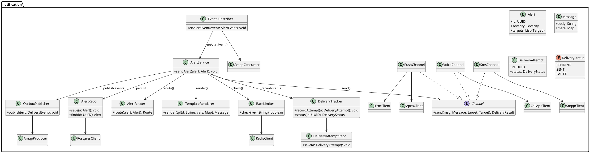

# ADR — Платформа мониторинга состояния животных на фермах (MVP)

**Автор:** spomprt  
**Дата:** 2025-08-10

---

## Проблема
На животноводческих фермах требуется автоматический мониторинг здоровья и поведения животных, контроль инфраструктуры (кормление, поение, фильтрация воды), оперативное обнаружение нештатных ситуаций и оповещение персонала. Система должна стабильно работать при нестабильной связи, поддерживать оборудование разных производителей и предоставлять метрики/интеграции во внешние системы.

---

## Функциональные требования
| № | Действующие лица или системы | Use Case | Описание |
| :-: | :- | :- | :- |
| 1 | Система видеоаналитики ← Видеокамеры | Обнаружение беспокойства/драк | Поток с камер анализируется; при детекции тревоги формируется событие, запускается оповещение. |
| 2 | Система видеоаналитики ← Видеокамеры | Обнаружение задавливания поросят | Модель детектирует характерные позы/скопления; генерирует критическое событие. |
| 3 | Оператор → Платформа → Кормушки/поилки | Управление кормлением/поением | Оператор задаёт режимы; агенты отправляют команды на контроллеры разных производителей. |
| 4 | Система видеоаналитики | Оценка состояния животных | Классификация: болезнь, гибель, беспокойство и т.п.; формирование статусов и алертов. |
| 5 | Агенты → Система фильтрации воды | Мониторинг фильтрации | Сбор телеметрии, контроль аварий, триггер оповещений. |
| 6 | Платформа | Пересчёт поголовья | Подсчёт особей по видеопотокам/датчикам; сверка с учётными данными. |
| 7 | Платформа | Учёт запасов и прогноз расхода корма/воды | Интеграция с данными склада и фактическим потреблением; прогнозирование. |
| 8 | Платформа | Поддержка множества камер | Приём потоков от камер разных производителей; масштабирование под реальное время. |
| 9 | Центральный сервер ↔ Агенты | Синхронизация данных | Агенты работают автономно; синхронизация с центром допускает задержку до 10 минут. |
| 10 | Платформа → Внешние системы | Экспорт метрик | Предоставление базовых метрик и возможность добавления пользовательских. |
| 11 | Платформа → Дежурный сотрудник | Локальные уведомления без интернета | При потере связи агент уведомляет дежурного локально; после восстановления — синхронизация. |
| 12 | Пользователи → Платформа (IdP) | Роли, аутентификация и авторизация | Современные механизмы (SSO, RBAC). |
| 13 | Мобильное/веб-приложение → API | Доступ к данным и управлению | Публичный API для клиентов (web/mobile). |

---

## Нефункциональные требования
| № | Требование |
| :-: | :- |
| N1 | Доступность системы не ниже 99,95%. |
| N2 | Оповещение от момента фиксации события видеоаналитикой до уведомления — не более 5 секунд. |
| N3 | Реакция видеоаналитики в реальном времени (миллисекунды) на уровне edge. |
| N4 | Расширяемость: добавление нового функционала и метрик без изменения существующего. |
| N5 | Работа при отсутствии интернета; локальные уведомления; последующая синхронизация. |
| N6 | Топология «центральный сервер — агенты»; задержка синхронизации до 10 минут (исключая проблемы связи). |
| N7 | Поддержка камер разных производителей; ночная съёмка; минимизация слепых зон. |
| N8 | Поддержка альтернативных каналов связи при нестабильном Wi‑Fi. |
| N9 | Безопасность: современные методы аутентификации (OIDC/SAML), авторизация по ролям. |

---

## Детали
- **Модель видеоаналитики**: предоставляется партнёрами; для MVP допустима путаница тени и животных; трекинг особей сложен из-за схожести.
- **Инфраструктура ферм**: нестабильный Wi‑Fi — предусмотреть альтернативные каналы связи; допускается один локальный сервер и набор edge‑устройств на ферму; камеры «рыбий глаз» возможны, но снижают качество.
- **Архитектурные принципы**: событийная модель; автономность агентов; приоритет обработки видео на edge для миллисекундной реакции; централизованный сбор и агрегация метрик.
- **Оповещения**: локальные каналы при оффлайне (SMS/звонок/локальный push), при онлайне — централизованные push/SMS/веб‑уведомления.

---

## Решение (контекст C1)
```plantuml
@startuml
!includeurl https://raw.githubusercontent.com/plantuml-stdlib/C4-PlantUML/master/C4_Context.puml
LAYOUT_WITH_LEGEND()

Person(op, "Оператор фермы", "Следит за состоянием, реагирует на оповещения")
Person(oncall, "Дежурный сотрудник", "Получает локальные уведомления при отсутствии интернета")

System_Boundary(core, "Платформа мониторинга животных (центральный сервер + агенты)") {
  System(system, "Платформа мониторинга животных",
    "Аналитика, учёт поголовья, управление оборудованием, оповещения, метрики, API")
}

System_Ext(apps, "Мобильное/веб-приложение", "Клиенты API")
System_Ext(cams, "Видеокамеры", "RTSP/ONVIF; дневная/ночная съёмка")
System_Ext(ml, "Партнёрская ML/видеоаналитика", "Готовая нейросеть")
System_Ext(feeders, "Кормушки и поилки", "Контроллеры разных производителей")
System_Ext(water, "Система фильтрации воды", "Датчики/PLC, телеметрия, аварии")
System_Ext(notify, "Провайдер уведомлений", "SMS/Push/звонки; локальный шлюз на ферме")
System_Ext(extsys, "Внешние системы", "ERP/SCADA/BI — приём метрик")
System_Ext(idp, "Провайдер аутентификации (IdP)", "OIDC/SAML; SSO, роли и авторизация")

Rel(op, apps, "Использует")
Rel(oncall, notify, "Получает локальные оповещения", "SMS/Push/звонок")

Rel(apps, system, "Публичный API", "HTTPS/JSON; Web/Mobile")
Rel(system, apps, "Пуш-события/оповещения", "WebSocket/SSE")

Rel(system, cams, "Получает видеопотоки/метаданные", "RTSP/ONVIF; real-time")
Rel(system, ml, "Отправляет кадры/фичи → получает оценки", "gRPC/REST")
Rel(system, feeders, "Команды управления дозированием/поением", "API/fieldbus")
Rel(system, water, "Мониторинг состояния/алертов", "API/датчики")
Rel(system, notify, "Оповещения о нештатных ситуациях", "SMS/Push/звонок ≤ 5 с")
Rel(system, extsys, "Экспорт метрик", "HTTP/MQTT/CSV")
Rel(system, idp, "Аутентификация/авторизация (RBAC)", "OAuth2/OIDC")

note right of system
• Центр + агенты: автономность агентов, синхронизация ≤ 10 мин
• Оффлайн-работа и локальные уведомления
• SLA 99,95%; оповещения ≤ 5 с; аналитика — миллисекунды
• Расширяемость и поддержка разнотипного оборудования
end note
@enduml
```

---

## Ограниченный контекст (для проектирования микросервисов, MVP)
**В рамках:** детекция по видео, управление устройствами, мониторинг фильтрации, пересчёт поголовья, оповещения, метрики, оффлайн‑режим, синхронизация ≤ 10 минут.  
**Вне рамок:** продвинутый трекинг/биометрия, оптимизация кормления, широкая SCADA/IIoT.

---

## Диаграмма контейнеров (C2)
```plantuml
@startuml
!includeurl https://raw.githubusercontent.com/plantuml-stdlib/C4-PlantUML/master/C4_Container.puml
LAYOUT_WITH_LEGEND()

System_Boundary(central, "Центральная платформа") {
  Container(api, "API Gateway", "REST/GraphQL", "Единая точка входа для клиентов и интеграций")
  Container(authz, "AuthN/RBAC Proxy", "OIDC/SAML", "Прокси к IdP, управление ролями")
  Container(eventbus, "Event Bus", "RabbitMQ (AMQP)", "Очереди команд/событий; мост MQTT")
  Container(notify, "Notification Service", "gRPC/REST + SMPP", "Push/SMS/звонки; SLA ≤ 5 с")
  Container(device, "Device Control Service", "gRPC/REST", "Управление кормушками/поилками; адаптеры")
  Container(count, "Animal Counting Service", "gRPC", "Агрегация пересчёта с edge, сверка")
  Container(inv, "Inventory & Forecast Service", "gRPC", "Учёт запасов и прогноз расхода")
  Container(metrics, "Metrics/Telemetry Service", "OTLP/HTTP", "Сбор и экспорт метрик (ERP/BI)")
  Container(sync, "Sync Orchestrator", "gRPC + AMQP", "Синхронизация с агентами (≤10 мин)")
  ContainerDb(pg, "PostgreSQL", "Relational DB", "Транзакционные данные")
  ContainerDb(ts, "TimescaleDB/InfluxDB", "Time-series DB", "Телеметрия и метрики")
  ContainerDb(obj, "Object Storage", "S3/MinIO", "Кадры/клипы/артефакты аналитики")
  Container(redis, "Redis", "Cache", "Кэш/квоты/сессии/rate limits")
}

System_Boundary(edge, "Агент на ферме (Edge)") {
  Container(ingest, "Video Ingest", "RTSP/ONVIF → gRPC", "Приём потоков, декодирование, выбор кадров")
  Container(ml, "Video Analytics (Inference)", "gRPC", "Модель партнёров; миллисекундные реакции")
  Container(localproc, "Edge Event Processor", "AMQP (embedded)", "Правила корреляции; локальные алерты")
  Container(localnotify, "Local Notifier", "SMS/GSM/PA", "Оповещения при оффлайне")
  Container(localdevice, "Edge Device Adapter", "OPC-UA/Modbus/TCP/MQTT", "Команды к оборудованию")
  Container(localsync, "Edge Sync Agent", "gRPC + AMQP", "Буферизация и синхронизация с центром")
  ContainerDb(localdb, "Local DB", "PostgreSQL/SQLite", "Локальные состояния и очереди (outbox)")
}

Person(op, "Оператор/Приложение", "Web/Mobile")
System_Ext(idp, "IdP", "OIDC/SAML")
System_Ext(cams, "Видеокамеры", "RTSP/ONVIF")
System_Ext(feeders, "Кормушки/поилки", "Контроллеры")
System_Ext(water, "Фильтрация воды", "Датчики/PLC")
System_Ext(smsgw, "SMS/Push провайдер", "SMPP/FCM/APNS")
System_Ext(erp, "ERP/SCADA/BI", "Экспорт метрик")

Rel(op, api, "REST/GraphQL + WebSocket/SSE")
Rel(api, authz, "OIDC/OAuth2", "AuthN/AuthZ")
Rel(authz, idp, "SSO", "OIDC/SAML")

Rel(api, notify, "Команды уведомлений")
Rel(api, device, "Команды управления")
Rel(api, count, "Запросы/отчёты пересчёта")
Rel(api, inv, "Запросы/отчёты запаса/прогнозов")
Rel(metrics, erp, "Экспорт метрик", "HTTP/MQTT/CSV")
Rel(notify, smsgw, "SMS/Push/звонки")
Rel(device, feeders, "Управление", "OPC-UA/Modbus/API")
Rel(device, water, "Мониторинг", "OPC-UA/Modbus/API")

Rel(eventbus, notify, "События/команды")
Rel(eventbus, device, "Команды")
Rel(eventbus, count, "События пересчёта")
Rel(eventbus, inv, "Телеметрия потребления")
Rel(eventbus, metrics, "Метрики")

Rel(sync, eventbus, "Оркестрация потоков")
Rel(sync, pg, "Persist")
Rel(sync, localsync, "Двунаправленная синхронизация", "gRPC + AMQP")
Rel(notify, redis, "Rate limits/locks")

Rel(count, pg, "CRUD")
Rel(inv, pg, "CRUD")
Rel(metrics, ts, "Write/Read")
Rel(count, obj, "Кадры/артефакты (при необходимости)")

Rel(cams, ingest, "RTSP/ONVIF")
Rel(ingest, ml, "Кадры/фичи", "gRPC")
Rel(ml, localproc, "События детекции", "AMQP (embedded)")
Rel(localproc, localdevice, "Команды", "MQTT/OPC-UA/Modbus")
Rel(localproc, localnotify, "Локальные алерты", "SMS/GSM/PA")
Rel(localsync, localproc, "Буферизация событий", "Outbox/AMQP")
Rel(localsync, eventbus, "Публикация событий", "AMQP/MQTT (мост)")
Rel(localsync, sync, "Служебная синхронизация", "gRPC")
Rel(localdb, localsync, "Persist")
Rel(localdevice, feeders, "Команды напрямую при оффлайне", "Fieldbus/MQTT")
Rel(localdevice, water, "Статусы/алерты", "Fieldbus/MQTT")

@enduml
```

---

## C3 — Диаграмма компонентов
```plantuml
@startuml
!includeurl https://raw.githubusercontent.com/plantuml-stdlib/C4-PlantUML/master/C4_Container.puml
!includeurl https://raw.githubusercontent.com/plantuml-stdlib/C4-PlantUML/master/C4_Component.puml

LAYOUT_WITH_LEGEND()

System_Boundary(central, "Центральная платформа") {
  Container_Boundary(api_ct, "API Gateway") {
    Component(api_rest, "REST Controllers", "HTTP", "CRUD/команды")
    Component(api_graphql, "GraphQL Resolvers", "GraphQL", "Агрегированные чтения")
    Component(api_ws, "WebSocket/SSE Hub", "WS/SSE", "Стриминг алертов ≤5с")
    Component(api_auth, "Auth Filter", "OIDC/JWT", "Авторизация/RBAC")
    Component(api_clients, "Service Clients", "gRPC", "Клиенты к backend‑сервисам")
  }

  Container_Boundary(notif_ct, "Notification Service") {
    Component(notif_cons, "Event Consumer", "AMQP", "Подписка на events.alerts")
    Component(notif_router, "Alert Router", "Core", "Маршрутизация по правилам/приоритетам")
    Component(notif_tpl, "Template Engine", "Core", "Рендер шаблонов сообщений")
    Component(notif_sms, "SMS Driver", "SMPP", "Отправка SMS")
    Component(notif_push, "Push Driver", "FCM/APNS", "Push‑уведомления")
    Component(notif_call, "Voice Driver", "Call API", "Звонки/озвучка")
    Component(notif_tracker, "Delivery Tracker", "Core", "Учёт попыток/статусов")
    Component(notif_rl, "RateLimiter Client", "Redis", "Ограничение частоты")
    Component(notif_outbox, "Outbox Publisher", "AMQP", "Гарантированная отправка/ретраи")
    ComponentDb(notif_db, "PostgreSQL", "DB", "CUD/история уведомлений")
  }

  Container_Boundary(device_ct, "Device Control Service") {
    Component(dev_cmd_api, "Command API", "gRPC/REST", "Команды к устройствам")
    Component(dev_orch, "Command Orchestrator", "Core", "Идемпотентность/подтверждения")
    Component(dev_adapters, "Adapter Registry", "Core", "OPC‑UA/Modbus/MQTT")
    Component(dev_state, "State Store", "Repo", "Состояние устройств")
    ComponentDb(dev_db, "PostgreSQL", "DB", "Конфигурация/статусы")
  }

  Container_Boundary(count_ct, "Animal Counting Service") {
    Component(cnt_ing, "Ingest Listener", "AMQP", "События детекции/снимки")
    Component(cnt_engine, "Counting Engine", "Core", "Подсчёт/агрегация")
    Component(cnt_recon, "Reconciliation", "Core", "Сверка/аномалии")
    ComponentDb(cnt_db, "PostgreSQL", "DB", "Результаты подсчёта")
    Component(cnt_obj, "Snapshot Store", "S3", "Хранение кадров/клипов")
  }

  Container_Boundary(metrics_ct, "Metrics/Telemetry Service") {
    Component(m_otlp, "OTLP Ingest", "HTTP", "Приём метрик")
    Component(m_writer, "TimeSeries Writer", "Core", "Запись в TSDB")
    Component(m_export, "Exporters", "HTTP/MQTT/CSV", "Выгрузка во внешние системы")
    ComponentDb(m_tsdb, "Timeseries DB", "DB", "Метрики/телеметрия")
  }

  Container(eventbus, "Event Bus", "RabbitMQ", "AMQP + MQTT мост")
}

System_Boundary(edge, "Edge‑агент (ферма)") {
  Component(edge_ing, "Video Ingest", "RTSP/ONVIF", "Приём/декодирование потоков")
  Component(edge_inf, "Inference Engine", "gRPC", "Модель партнёров, миллисекунды")
  Component(edge_rules, "Rules Engine", "Core", "Корреляция/правила/фильтрация")
  Component(edge_notify, "Local Notifier", "SMS/GSM/PA", "Локальные алерты оффлайн")
  Component(edge_dev, "Device Adapter", "OPC‑UA/Modbus/MQTT", "Команды к оборудованию")
  Component(edge_sync, "Sync Agent", "gRPC/AMQP", "Буферизация/синхронизация")
  ComponentDb(edge_db, "Local DB", "SQLite/Postgres", "Outbox/кеш/состояния")
}

Rel(api_ws, eventbus, "Подписка на события алертов", "AMQP → WS")
Rel(notif_cons, eventbus, "Consume events.alerts")
Rel(notif_outbox, eventbus, "Publish delivery events")
Rel(dev_orch, eventbus, "Команды к edge", "commands.device")
Rel(cnt_ing, eventbus, "Consume детекции/снимки")
Rel(m_otlp, eventbus, "Приём телеметрии через мост MQTT", "MQTT→AMQP")

Rel(edge_inf, edge_rules, "События детекции")
Rel(edge_rules, edge_dev, "Команды")
Rel(edge_rules, edge_notify, "Локальные алерты")
Rel(edge_sync, eventbus, "Публикация событий", "AMQP/MQTT")
Rel(edge_sync, cnt_ing, "Передача снимков/метаданных", "S3 pre‑signed/AMQP")

@enduml
```

---

## C4 — Диаграмма кода (пример: Notification Service)


---

## Интеграции и обоснование подходов/технологий
**Коммуникации:** gRPC (синхронно), RabbitMQ/AMQP (асинхронно) с мостом MQTT для edge; REST/WS для внешних клиентов; OIDC/SAML через IdP.  
**Хранилища:** PostgreSQL (транзакции), TimescaleDB/InfluxDB (метрики), S3/MinIO (кадры/клипы), Redis (кеш, квоты), локальная БД на edge (outbox).  
**Синхронизация центр ↔ edge:** Outbox + ретраи, идемпотентность, порядок в пределах ключа; eventual‑consistency ≤ 10 мин; команды с подтверждениями и fence‑ID.  
**Очередь:** RabbitMQ (кластерабелен, не требователен, MQTT‑мост); ограничение — при экстремальной нагрузке переводить тяжелые потоки в Kafka.

---

## Компромиссы и риски
| Область | Выбор | Преимущества | Компромиссы/Риски | Митигирующие меры |
|---|---|---|---|---|
| Шина сообщений | RabbitMQ (AMQP) + MQTT мост | Простота, MQTT для устройств, кластеризация | Не для экстремально высокой пропускной, слабый ретеншн/реплей | Kafka для нагруженных потоков; DLX/партиционирование |
| Коммуникации сервис‑сервис | gRPC | Низкая задержка, строгие схемы | Нет поддержки из браузера | Публичный REST/WS через API Gateway |
| Обработка видео | Edge Inference | Миллисекундная реакция, меньше трафика | Нужны GPU/NPUs и управление версиями | Канареечные обновления, реестр моделей, fallback‑правила |
| Консистентность | Eventual для телеметрии | Живучесть при оффлайне | Временные расхождения центр↔edge | SLA ≤ 10 мин, версионирование, LWW‑конфликты |
| Оповещения | Центр + Local Notifier | ≤ 5 с онлайн; оффлайн‑алерты | Дубли при retry | Идемпотентность alert‑ID, дедупликация, rate‑limits |
| Хранилища | Postgres + TSDB + S3 | Соответствие типам данных | Операционная сложность нескольких БД | Автоматизация, бэкапы, ретеншн‑политики |
| Устройства | OPC‑UA/Modbus/MQTT | Совместимость | Разнородность драйверов | Шлюзы/адаптеры, эмуляторы, контрактные тесты |
| Безопасность | OIDC/SAML + mTLS | Централизованный доступ | Устройства без TLS | Сегментация сетей, VPN, закрытые сегменты для fieldbus |

---

## Критерии для выбора решения
1) Функциональное покрытие; 2) Задержки/real‑time; 3) Оффлайн; 4) Масштабирование; 5) Расширяемость;  
6) Совместимость устройств; 7) Надёжность; 8) Безопасность; 9) Наблюдаемость; 10) Стоимость;  
11) Time‑to‑Market; 12) Vendor lock‑in; 13) Гарантии доставки.

### Оценка по критериям
| Критерий | Оценка | Обоснование |
|---|---|---|
| Функциональное покрытие | **Высокая** | Все бизнес‑кейсы закрываются выделенными сервисами и API. |
| Задержки/real‑time | **Высокая** | Edge inference + AMQP; WS/SSE push. |
| Оффлайн/связь | **Высокая** | Local Notifier, outbox, буферизация и синхронизация. |
| Масштабирование | **Средняя→Высокая** | Горизонтальный скейл; тяжёлые потоки можно вынести в Kafka. |
| Расширяемость | **Высокая** | События, адаптеры устройств, расширяемые метрики. |
| Совместимость устройств | **Высокая** | OPC‑UA/Modbus/MQTT, унифицированные адаптеры. |
| Надёжность/доступность | **Средняя→Высокая** | HA RabbitMQ, реплики БД, retry. |
| Безопасность | **Высокая** | IdP, RBAC, сегментация, mTLS. |
| Наблюдаемость | **Высокая** | Метрики/логи/трейсы, трекинг доставки, rate‑limits. |
| Стоимость | **Средняя** | Нужны edge‑ресурсы, но экономим трафик/облако; open‑source стек. |
| Time‑to‑Market | **Высокая** | Зрелые технологии — быстрый MVP. |
| Vendor lock‑in | **Низкий** | Взаимозаменяемые компоненты (Kafka/TSDB/S3‑совместимое). |
| Гарантии доставки | **Высокая** | At‑least‑once, идемпотентность, outbox/DLX. |

---

## Резюме (почему рекомендую)
Решение **выполняет жесткие SLA по времени реакции**, **работает без интернета**, **масштабируется и эволюционирует** без смены доменной модели. Мы осознанно используем **RabbitMQ** для MVP (простота, MQTT‑мост, кластеризация) и заранее заложили путь для переноса тяжелых потоков в **Kafka**. Безопасность на уровне предприятия (SSO, RBAC, mTLS) и высокая наблюдаемость снижают операционные риски. **Итог:** это практичный баланс скорости вывода продукта, стоимости и надёжности, с чёткими точками роста без «переписывания с нуля».
